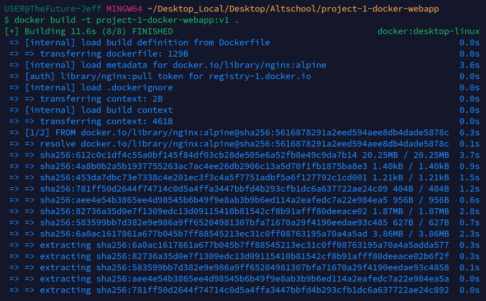
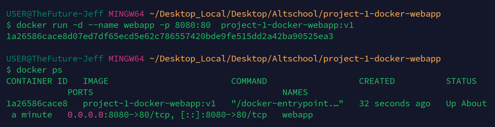
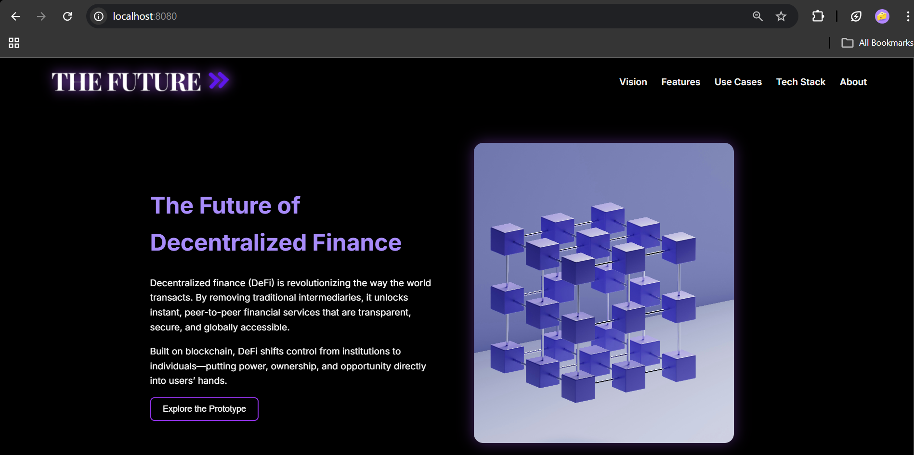

# Dockerized Web App

## Overview
A simple responsive web application containerized using Docker.

## Features
- Runs in isolated container
- Lightweight image
- Easy local deployment
- Reproducible environment

## Tech Stack
- HTML
- CSS
- Docker
- Nginx

## How to Run

```bash
docker build -t project-1-docker-webapp:v1 .
docker run -d --name webapp -p 8080:80 project-1-docker-webapp:v1
```

## Visuals
- Build:



- Run / Ps:



- Live App:

